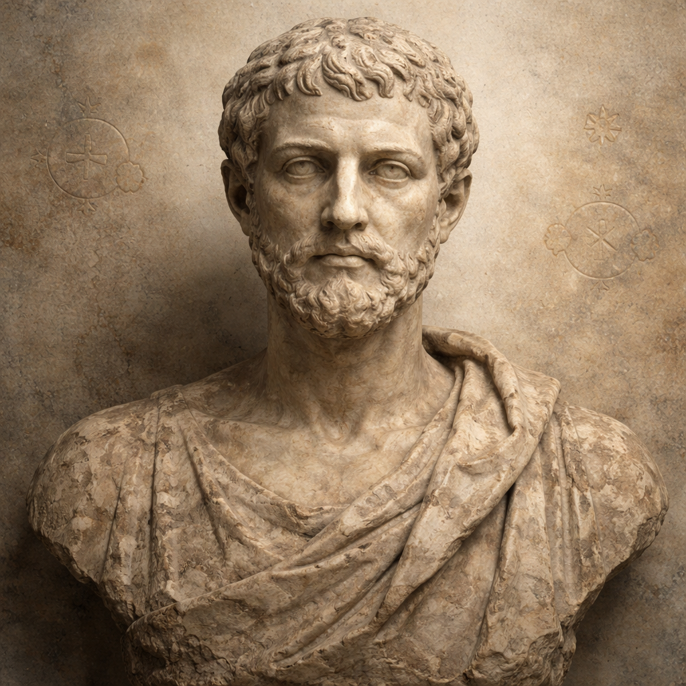

# 架空の科学者を１万人生成

## はじめに

「〇〇で歌ってみたシリーズ」（特定ジャンルの名詞のみで元歌の発音を再現する替え歌）を自動生成する研究をしていますが、実在の人物名やビジュアルを使うと権利関係が気になります。

そこで、研究や一般公開用途で気兼ねなく使える**完全に架空の科学者を大量に生成**することにしました。

## 方針
以下のデータを得るための方法を検討します。
件数は１万人くらいを目指したいです。

- 名前（姓・名・読み仮名）
- 主な分野・研究内容
- 肖像画（PNG）

### 1. ChatGPT と相談してクォータ（種）を設計する

LLMで本格的に生成するための種として、「時代 × 国籍 × 分野 × 性別」の組み合わせを設計しました。

```quota.csv
id,era_order,era_name,birth_year_band,birth_year_start,birth_year_end,field,gender,nationality_region,nationality
古代前期__自然哲学__古代ギリシア__0001,1,古代前期,紀元前400–紀元前1,-400,-1,自然哲学,男性,東地中海,古代ギリシア
古代後期__天文学・宇宙論__アレクサンドリア・エジプト圏__0001,2,古代後期,1–499,1,499,天文学・宇宙論,女性,北アフリカ,アレクサンドリア・エジプト圏
中世前期__数学・幾何学__イスラム世界__0001,3,中世前期,500–999,500,999,数学・幾何学,男性,西アジア,イスラム世界
中世後期__暦法・観測学__宋元中国圏__0001,4,中世後期,1000–1399,1000,1399,暦法・観測学,女性,東アジア,宋元中国圏
ルネサンス・初期近世__光学__イタリア諸邦__0001,5,ルネサンス・初期近世,1400–1599,1400,1599,光学,男性,西欧,イタリア諸邦
近世前期__力学__イングランド__0001,6,近世前期,1600–1699,1600,1699,力学,女性,西欧,イングランド
近世後期__熱学・統計物理__フランス__0001,7,近世後期,1700–1799,1700,1799,熱学・統計物理,男性,西欧,フランス
近代前期__電磁気学__ドイツ__0001,8,近代前期,1800–1849,1800,1849,電磁気学,女性,西欧,ドイツ
近代後期__実験物理__日本__0001,9,近代後期,1850–1899,1850,1899,実験物理,男性,東アジア,日本
現代前期__理論物理__米国__0001,10,現代前期,1900–1949,1900,1949,理論物理,女性,北米,米国
現代中期__原子核物理__ソ連・ロシア__0001,11,現代中期,1950–1979,1950,1979,原子核物理,男性,東欧,ソ連・ロシア
現代後期__量子情報・量子技術__中国__0001,12,現代後期,1980–1999,1980,1999,量子情報・量子技術,女性,東アジア,中国
現代最年少__計算物理__インド__0001,13,現代最年少,2000–2009,2000,2009,計算物理,男性,南アジア,インド
```

これを作った理由は、１万件だと、何も考えずに生成すると、LLMのクセによって年代、性別、業績等が偏ったり、重複するデータが生成される懸念があったためです。
どういった属性を何人くらい用意すべきかは、ChatGPTと相談しながら決めました。
最終的に以下のような属性を組み合わせることにしました。

- **時代区分**：古代前期（紀元前400〜紀元前1）、古代後期、中世、近世、近代、現代 など
- **国籍・地域**：古代ギリシア、戦国・秦漢中国圏、古代インド圏、近代日本、現代アフリカ など多数
- **研究分野**：光学、力学、天文学、化学、生物学、数学 など
- **性別**：男性・女性・ノンバイナリー／その他

各組み合わせの件数もChatGPTに相談しながら決めました。
昔の人の情報が現代の人よりも多く残るのは違和感があったので、均等ではなく、現代に近い時代の方が多くなるようにしました。

### 2. 名前を生成する

クォータCSV を入力として、名前を`gpt-4.1-mini`で生成します。

各行の時代・国籍・性別情報をプロンプトに渡し、姓・名・読み仮名を出力します。

```
出力フィールド: 名前, 姓, 名, ナマエ, セイ, メイ
```

実際の実行結果は以下です。見やすさのため、時代等の情報が含まれるidとフルネームの列のみ記載しています。
なんとなく時代や国籍に合った名前が生成されていることがわかります。

```names.csv
id,名前
古代前期__自然哲学__古代ギリシア__0001,デイノクラテス
古代後期__天文学・宇宙論__アレクサンドリア・エジプト圏__0001,テリュッキス ネフェラ
中世前期__数学・幾何学__イスラム世界__0001,アル=ハーリス バルサーミー
中世後期__暦法・観測学__宋元中国圏__0001,林 芸茹
ルネサンス・初期近世__光学__イタリア諸邦__0001,ルイージ ベルナルディ
近世前期__力学__イングランド__0001,Eleanor Fairbairn
近世後期__熱学・統計物理__フランス__0001,ジャン＝リュック ブレトン
近代前期__電磁気学__ドイツ__0001,エミーリエ ランゲ
近代後期__実験物理__日本__0001,小泉 拓海
現代前期__理論物理__米国__0001,Clara Warrington
現代中期__原子核物理__ソ連・ロシア__0001,アンドレイ コルネイエフ
現代後期__量子情報・量子技術__中国__0001,陳 思悦
現代最年少__計算物理__インド__0001,アニル パテル
```
### 3. プロフィールを生成する

クォータCSV を入力として、名前以外のプロフィール情報を`gpt-4.1-mini`で生成します。
実装のシンプルさを優先して、名前は使わずに、クォータCSVのみから研究業績等を生成します。

```
出力フィールド: 生年, 没年, 研究内容（要約）
```

実際の実行結果は以下です。生没年となんとなく対応した研究内容が生成されていることがわかります。

```profiles.jsonl
{"生年": "紀元前4世紀末頃（約紀元前308年頃）", "没年": "紀元前280年頃", "研究内容（要約）": "感覚器官と自然界の結びつきを論じ、現象認識の哲学基盤を探求"}
{"生年": "紀元2世紀半ば頃", "没年": "不明", "研究内容（要約）": "星々の運行と宇宙の中心に関する観測的理論を構築"}
{"生年": "6世紀中頃頃", "没年": "6世紀末頃", "研究内容（要約）": "楕円曲線の比例割法を用い図形問題の解法体系を構築"}
{"生年": "至元十五年（1328年）頃", "没年": "不明", "研究内容（要約）": "観測記録に基づく天文暦表の誤差訂正と季節予測手法の改良"}
{"生年": "1498年頃", "没年": "1563年頃", "研究内容（要約）": "屈折率変化の実験的解析により、大気光変異の理論的基盤を構築"}
{"生年": "1646年頃", "没年": "1693年頃", "研究内容（要約）": "実用的機械の動力伝達を探求し、新素材の摩擦特性を分析"}
{"生年": "1782年頃", "没年": "1847年", "研究内容（要約）": "熱運動と統計的法則の関係を理論的に解析し熱平衡の新枠組みを提案"}
{"生年": "1814年", "没年": "1887年", "研究内容（要約）": "電磁誘導の時間変化を定量的に解析し変圧器理論の基礎を確立"}
{"生年": "1870年", "没年": "1942年", "研究内容（要約）": "精密干渉計を用いた光波の位相変動と温度依存性の実験的研究"}
{"生年": "1913年", "没年": "1982年", "研究内容（要約）": "非線形量子場理論に基づく相転移の統計的モデルを理論化"}
{"生年": "1957年", "没年": null, "研究内容（要約）": "高強度イオンビームの制御と核反応過程の動的解析を精密実験で解明"}
{"生年": "1983年", "没年": null, "研究内容（要約）": "量子通信ネットワークの耐障害性向上に向けた非正規ノイズ制御技術の開発"}
{"生年": "2001年", "没年": null, "研究内容（要約）": "大規模シミュレーションによる複雑系相転移の新指標開発と応用"}
```

### 4. 時代に合った肖像画プロンプトと画像を生成する

プロフィール JSONL を入力として、LLMで画像生成用プロンプトを作成します。

ポイントは**時代考証**です。古代の科学者には油彩画や彫刻、近代の科学者にはモノクロ写真風など、時代に合ったスタイルをプロンプトに反映させます。

実際の実行結果は以下です。１件だけ抜粋します。


```json
{
  "id": "古代前期__自然哲学__古代ギリシア__0001",
  "era": "古代前期",
  "gender": "男性",
  "nationality": "古代ギリシア",
  "field": "自然哲学",
  "portrait_prompt": "紀元前4世紀後半頃の古代ギリシアの自然哲学者を表現した風化した大理石彫刻バスト。顔立ちは知的で自然な印象を持ち、過度な美化や英雄化は避けている。髪型は当時のギリシア風の短髪で、服装はシンプルなヒマティオンの端がわずかに見える。背景は単色に近い経年変化のある石材で、宇宙の生成と元素を示唆する象徴的な小さな円形装飾が控えめに配置されている。保存状態は激しく風化し部分的に磨耗したが、顔や目、指などの破綻はなく自然な表情を保っている。ポーズは正面向きのバスト断片で、静謐かつ厳かな雰囲気を持たせている。肖像は実在しない人物として、歴史的リアリティを重視して制作すること。"
}
```

生成したプロンプトを用いて、`gpt-image-1.5` で 1024x1024 の PNG を生成し、保存します。
上記のプロンプトから生成された画像は以下です。



### 6. 全体を１ファイルに纏める

各フェーズの出力（クォータCSV、名前 CSV・プロフィール JSONL・肖像画パス）をマージして、最終的な `catalog.csv` を生成します。
２行だけ抜粋した結果を以下に示します。

```csv
id,era_order,era_name,field,gender,nationality_region,nationality,full_name,last_name,first_name,full_name_reading,last_name_reading,first_name_reading,birth_year,death_year,research_summary,portrait_path,portrait_exists
古代前期__自然哲学__古代ギリシア__0001,1,古代前期,自然哲学,男性,東地中海,古代ギリシア,デルエウス,,デルエウス,デルエウス,,デルエウス,紀元前4世紀後半頃,紀元前310年頃,宇宙の生成と元素の根源に関する哲学的考察,data/sample/two/portraits/古代前期__自然哲学__古代ギリシア__0001.png,True
近代後期__実験物理__日本__0001,9,近代後期,実験物理,男性,東アジア,日本s,佐藤 隆志,佐藤,隆志,サトウ タカシ,サトウ,タカシ,1854年,1912年,熱電現象の物理的機構と磁場下での電気伝導特性の実験的解析,data/sample/two/portraits/近代後期__実験物理__日本__0001.png,True
```
## パイプライン全体像

```
クォータCSV
    ↓ generate_name.py     — 名前・読み仮名を生成
    ↓ generate_profile.py  — プロフィールを生成
    ↓ generate_portrait_prompt.py  — 肖像画プロンプトを生成
    ↓ generate_images.py   — 肖像画 PNG を生成
最終 CSV（catalog.csv）
```

## 生成結果


## まとめ

- ChatGPT と対話してクォータを設計することで、時代・地域・性別のバランスが取れた１万人分のデータが得られた
- 名前・プロフィール・肖像画プロンプト・画像をすべて OpenAI API で生成するパイプラインを構築
- 時代考証をプロンプトに組み込むことで、それぞれの時代らしい肖像画スタイルが実現できた
- 著作権・肖像権フリーな架空人物データセットとして、様々なコンテンツ制作に活用できる

## 参考

<!-- TODO: 参考にしたリンクや資料を追加 -->
